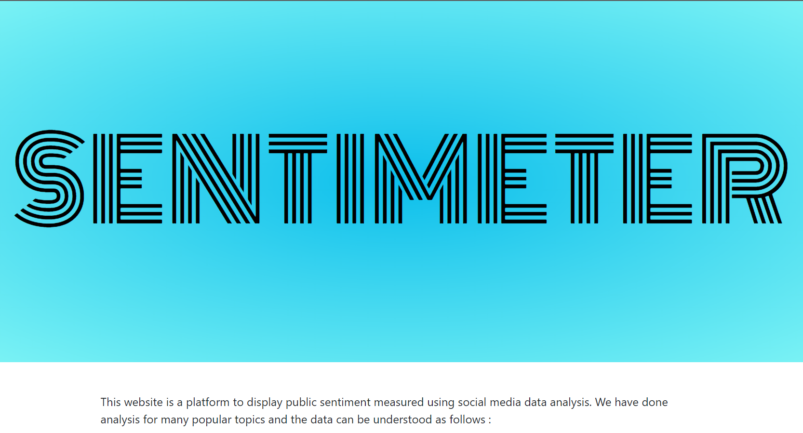
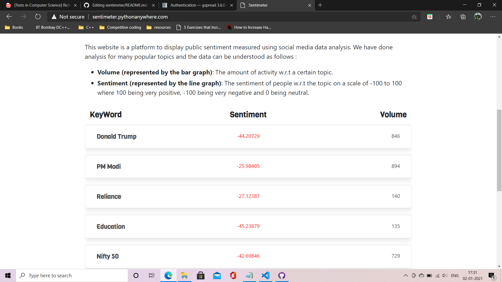
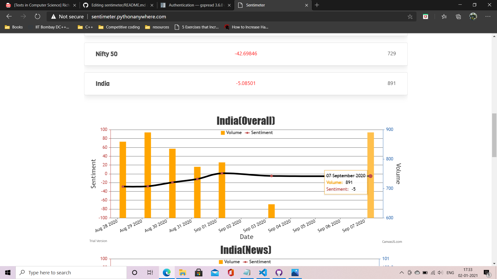

# Sentimeter

This is the project to scrape data related to a keyword from news websites, reddit and twitter and then do a sentiment analysis using NLTK or Flair. 

The final_data.py is a scheduler script that fetches the data from the websites once per day.  

The data is stored in a google spreadsheet including the volume(number of data entries fetched) and the average sentiment for each of the sources and keys. This allows easy analysis of the data using charts and maps. 

The website folder contains the code for the site used to visualise the data using graphs. This is a django website and can easily be run using the command: `python manage.py runserver` in the same folder. A demo version is available at: http://sentimeter.pythonanywhere.com/(may be down by the time you see this).

### BEFORE USING THE SCRIPT
1. Replace the details for reddit api in the final_data.py
2. Make a Sentdex.json file containing the information about the google sheet you are using in the same directory as the final_data.py. Refer to this page about how to get the credentials: https://gspread.readthedocs.io/en/latest/oauth2.html#for-bots-using-service-account.
3. Add the same data to Sentdex.json in website/sent
4. Install all the libraries listed in the requirements.txt
5. You are good to go. Run the script final_data.py and you will see the google sheet getting populated with data.
